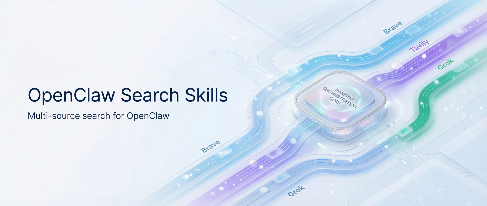

<div align="center">

# OpenClaw Search Skills

[English](./docs/README_EN.md) | 简体中文

**为 OpenClaw 提供多源搜索、线程深抓与高保真内容提取的一组生产级 Skills。**

[](https://github.com/openclaw/openclaw)
[](https://www.python.org/downloads/)
[](./LICENSE)
[](./search-layer/SKILL.md)
[](./content-extract/SKILL.md)

</div>

> 📦 本仓库已收录至 [openclaw-skills](https://github.com/blessonism/openclaw-skills)（聚合仓库，包含更多 Skills）。如果你想追完整能力集合，优先 Star 聚合仓库。

---

## 一、概述

`openclaw-search-skills` 是一组面向 [OpenClaw](https://github.com/openclaw/openclaw) Agent 的可组合搜索能力集合，覆盖从 **找资料**、**抓上下文**、**提正文** 到 **追引用链** 的完整链路。

最初它们是为 [github-explorer](https://github.com/blessonism/github-explorer-skill) 提供底层能力，后来因为复用频率太高，拆成了独立仓库。

```text
OpenClaw Agent
├── search-layer      多源搜索编排 / 意图感知评分 / Thread Pulling
├── content-extract   URL → 干净 Markdown / 反爬站点自动降级
│   └── mineru-extract 高保真解析（PDF / Office / HTML / OCR）
└── OpenClaw 内置工具 web_search / web_fetch / browser
```

### 适合什么场景

- **研究与事实核查**：同一问题并行搜多个源，降低单源偏差
- **GitHub 问题排查**：不只看 issue body，还能继续拉评论、引用和后继线程
- **网页资料沉淀**：把文章、PDF、Office 文档稳定转成干净 Markdown
- **反爬站点提取**：普通抓取不稳时，自动切到 MinerU 兜底

### 仓库包含的 Skills

| Skill | 解决什么问题 |
|-------|-------------|
| **[search-layer](./search-layer/)** | 四源并行搜索（Brave + Exa + Tavily + Grok）+ 学术检索模式（OpenAlex + Semantic + Tavily）+ 意图感知评分 + 自动去重 + 链式引用追踪。Brave 由 OpenClaw 内置的 `web_search` 提供。 |
| **[content-extract](./content-extract/)** | URL → 干净的 Markdown。遇到反爬站点（微信、知乎）自动降级到 MinerU 解析。 |
| **[mineru-extract](./mineru-extract/)** | [MinerU](https://mineru.net) 官方 API 的封装层。把 PDF、Office 文档、HTML 页面转成 Markdown。 |

### 它们之间的关系

```text
github-explorer（独立 repo）
├── search-layer ───── Exa + Tavily + Grok 并行搜索 + 意图评分 + 链式追踪   ← 本仓库
├── content-extract ── 智能 URL → Markdown                                   ← 本仓库
│   └── mineru-extract ─ MinerU API（重活）                                  ← 本仓库
└── OpenClaw 内置工具 ─ web_search (Brave), web_fetch, browser
```

---

## search-layer v3.1 新特性（最新）

v3.1 在 v3.0 深度链式追踪基础上，新增 **Academic 学术检索模式** 与 **导出能力**。

### Academic 模式（v3.1）

- 新增 `--mode academic`：并行使用 `OpenAlex + Semantic Scholar + Tavily`
- 新增 `--intent academic`：评分权重偏向权威性（authority 最高）
- 新增 `--export`：支持 `bibtex` / `csv` / `markdown` / `citations`
- `--source` 扩展支持 `openalex,semantic_scholar`（兼容别名 `semantic`）

```bash
# 学术检索
python3 search-layer/scripts/search.py "transformer architecture" \
  --mode academic --intent academic --num 5

# 导出 BibTeX
python3 search-layer/scripts/search.py "transformer architecture" \
  --mode academic --intent academic --export bibtex
```

---

v3.0 在四源并行搜索的基础上新增了**深度链式追踪**能力，让 agent 能够顺藤摸瓜、追踪信息的完整引用链。

### 新增工具

**`fetch_thread.py`** — 结构化深抓多平台帖子/议题：

| 平台 | 方法 | 获取内容 |
|------|------|---------|
| GitHub Issue/PR | REST API | 正文 + 全部评论 + 跨引用 PR/issue + commit 引用 |
| Hacker News | Algolia API | 帖子 + 递归评论树（无限深度，上限 200 条） |
| Reddit | \`.json\` 端点 | 帖子 + 评论树（深度 ≤ 4，上限 200 条） |
| V2EX | API | 主题 + 全部回复 |
| 通用网页 | trafilatura → BS4 → regex 三层回退 | 正文 + 链接 |

```bash
# GitHub issue 或 PR
python3 search-layer/scripts/fetch_thread.py "https://github.com/owner/repo/issues/123"
python3 search-layer/scripts/fetch_thread.py "https://github.com/owner/repo/pull/456" --format markdown

# 仅提取引用（快速模式）
python3 search-layer/scripts/fetch_thread.py "https://github.com/owner/repo/issues/123" --extract-refs-only

# HN / Reddit / 任意网页
python3 search-layer/scripts/fetch_thread.py "https://news.ycombinator.com/item?id=43197966"
python3 search-layer/scripts/fetch_thread.py "https://www.reddit.com/r/Python/comments/abc123/title/"
python3 search-layer/scripts/fetch_thread.py "https://example.com/blog/post"
```

**`chain_tracker.py`** — 引用图的广度优先遍历，自动展开引用链（max_depth 可配）。

**`relevance_gate.py`** — 在追踪过程中对候选 URL 进行相关性评分，过滤低价值节点，避免无限扩散。

### search.py — Phase 3.5：Thread Pulling

搜索后自动提取结果 URL 的引用图：

```bash
# 搜索 + 自动提取引用
python3 search-layer/scripts/search.py "OpenClaw config validation bug" \
  --mode deep --intent status --extract-refs

# 跳过搜索，直接对已知 URL 提取引用
python3 search-layer/scripts/search.py --extract-refs-urls \
  "https://github.com/owner/repo/issues/123" \
  "https://github.com/owner/repo/issues/456"
```

输出结果新增 \`refs\` 字段，并行 fetch（ThreadPoolExecutor，最多 4 workers，上限 20 URLs）。

### Agent 链式追踪工作流

```
1. search.py → 初始搜索结果
2. --extract-refs → 提取引用图
3. Agent 筛选高价值节点
4. fetch_thread.py → 深抓每个节点
5. 重复直到信息闭合（推荐 max_depth=3）
```

### 输出结构（fetch_thread.py）

```json
{
  "url": "...",
  "type": "github_issue | github_pr | hn_item | reddit_post | v2ex_topic | web_page",
  "title": "...",
  "body": "...",
  "comments": [{"author": "...", "date": "...", "body": "..."}],
  "comments_tree": [{"author": "...", "depth": 0, "replies": [...]}],
  "refs": ["#123", "owner/repo#456", "https://..."],
  "links": [{"url": "...", "anchor": "...", "context": "..."}],
  "metadata": {}
}
```

`comments` 始终是向后兼容的平铺列表；`comments_tree` 是完整的嵌套结构（HN 和 Reddit 可用）。

---

## search-layer v2.2 特性

v2.2 增强了 Grok 源的稳定性，新增源过滤功能：

- **源过滤**：`--source grok,exa` 指定只使用特定搜索源，方便测试和对比
- **默认模型升级**：Grok 默认模型从 `grok-4.1` 切换到 `grok-4.1-fast`（更快更稳定）
- **Thinking 标签处理**：自动剥离 Grok thinking 模型的 `<think>` 标签
- **JSON 提取增强**：处理 Grok 在 JSON 前输出自然语言文字的情况（`raw_decode` + `rfind` fallback）
- **Credentials 文件**：统一凭据管理，`~/.openclaw/credentials/search.json` 集中存放所有搜索源 key

## search-layer v2.1 特性

v2.1 新增 **Grok (xAI)** 作为第四搜索源，通过 Completions API 调用，支持 API 代理站：

- **Grok 搜索源**：利用 Grok 模型的实时知识返回结构化搜索结果，擅长时效性查询和权威源识别
- **四源并行**：Deep 模式下 Exa + Tavily + Grok 三源并行（加上 agent 层的 Brave 共四源）
- **智能降级**：Grok 配置缺失时自动降级为 Exa + Tavily 双源，不影响现有流程
- **SSE 兼容**：自动检测并处理 API 代理强制 stream 的情况
- **安全加固**：查询注入防护（`<query>` 标签隔离）、URL scheme 验证（仅 http/https）
- **日期提取**：Grok 结果包含 `published_date`，参与新鲜度评分

## search-layer v2 特性

v2 借鉴了 [Anthropic knowledge-work-plugins](https://github.com/anthropics/knowledge-work-plugins) 的 enterprise-search 设计，新增：

- **意图分类**：支持 8 种查询意图（新增 `academic`），自动调整搜索策略和评分权重
- **多查询并行**：`--queries "q1" "q2" "q3"` 同时执行多个子查询
- **意图感知评分**：`score = w_keyword × keyword_match + w_freshness × freshness_score + w_authority × authority_score`，权重由意图类型决定
- **域名权威性评分**：内置四级域名评分表（60+ 域名 + 模式匹配规则）
- **Freshness 过滤**：`--freshness pd/pw/pm/py` 实际传递给 Tavily
- **Domain Boost**：`--domain-boost github.com,stackoverflow.com` 提升特定域名权重
- **完全向后兼容**：不带新参数时行为与 v1 一致

---

## 安装

### 方式一：让 OpenClaw 帮你装（推荐 🚀）

直接在对话里告诉你的 OpenClaw agent：

> 帮我安装这个 skill：https://github.com/blessonism/openclaw-search-skills

### 方式二：手动安装

```bash
# 1. Clone 到任意位置
mkdir -p ~/.openclaw/workspace/_repos
git clone https://github.com/blessonism/openclaw-search-skills.git \
  ~/.openclaw/workspace/_repos/openclaw-search-skills

# 2. 链接到你的 skills 目录
cd ~/.openclaw/workspace/skills

ln -s ~/.openclaw/workspace/_repos/openclaw-search-skills/search-layer search-layer
ln -s ~/.openclaw/workspace/_repos/openclaw-search-skills/content-extract content-extract
ln -s ~/.openclaw/workspace/_repos/openclaw-search-skills/mineru-extract mineru-extract
```

> 💡 skills 目录因安装方式不同可能不同，常见的是 `~/.openclaw/workspace/skills/` 或 `~/.openclaw/skills/`。

---

## 配置

### 搜索 API Keys（search-layer 需要）

**方式一：Credentials 文件（推荐）**

创建 `~/.openclaw/credentials/search.json`：

```json
{
  "exa": "your-exa-key",
  "tavily": "your-tavily-key",
  "grok": {
    "apiUrl": "https://api.x.ai/v1",
    "apiKey": "your-grok-key",
    "model": "grok-4.1-fast"
  },
  "openalex": "your-openalex-key-optional",
  "semantic": "your-semantic-scholar-key-optional",
  "semantic_scholar": "your-semantic-scholar-key-optional"
}
```

> 💡 `openalex` 与 `semantic(_scholar)` 为可选字段；未配置时 `academic` 模式会自动降级为可用源组合。

**方式二：环境变量（兼容）**

```bash
export EXA_API_KEY="your-exa-key"        # https://exa.ai
export TAVILY_API_KEY="your-tavily-key"  # https://tavily.com
export GROK_API_URL="https://api.x.ai/v1"  # 可选
export GROK_API_KEY="your-grok-key"      # 可选
export GROK_MODEL="grok-4.1-fast"        # 可选，默认 grok-4.1-fast
export OPENALEX_API_KEY="your-openalex-key"      # 可选
export SEMANTIC_API_KEY="your-semantic-key"      # 可选
export SEMANTIC_SCHOLAR_API_KEY="your-semantic-key"  # 可选，等价别名
```

环境变量会覆盖 credentials 文件中的同名配置。

Brave API Key 由 OpenClaw 内置的 `web_search` 工具管理，不需要在这里配置。

### MinerU Token（可选，content-extract 需要）

只有当你需要抓取微信/知乎/小红书等反爬站点时才需要：

```bash
cp mineru-extract/.env.example mineru-extract/.env
# 编辑 .env，填入你的 MinerU token（从 https://mineru.net/apiManage 获取）
```

### Python 依赖

```bash
# 基础依赖（search-layer v2.x）
pip install requests

# v3.0 链式追踪新增依赖
pip install trafilatura beautifulsoup4 lxml
```

---

## 使用示例

### search-layer

```bash
# 基础搜索（v1 兼容模式）
python3 search-layer/scripts/search.py "RAG framework comparison" --mode deep --num 5

# 意图感知模式（v2+）
python3 search-layer/scripts/search.py "RAG framework comparison" --mode deep --intent exploratory --num 5

# 多查询并行
python3 search-layer/scripts/search.py --queries "Bun vs Deno" "Bun advantages" "Deno advantages" \
  --mode deep --intent comparison --num 5

# 最新动态 + 时间过滤
python3 search-layer/scripts/search.py "Deno 2.0 latest" --mode deep --intent status --freshness pw

# 单源测试
python3 search-layer/scripts/search.py "OpenAI latest news" --mode deep --source grok --num 5

# 搜索 + 链式追踪（v3.0）
python3 search-layer/scripts/search.py "OpenClaw config bug" --mode deep --intent status --extract-refs

# 学术检索（v3.1）
python3 search-layer/scripts/search.py "transformer architecture" --mode academic --intent academic --num 5

# 学术导出（v3.1）
python3 search-layer/scripts/search.py "transformer architecture" --mode academic --intent academic --export bibtex
```

模式：`fast`（Exa 优先）、`deep`（Exa + Tavily + Grok 并行）、`answer`（Tavily 带 AI 摘要）、`academic`（OpenAlex + Semantic + Tavily）

意图：`factual`、`status`、`comparison`、`tutorial`、`exploratory`、`news`、`resource`、`academic`

### fetch_thread.py（v3.0 新增）

```bash
# GitHub issue / PR
python3 search-layer/scripts/fetch_thread.py "https://github.com/owner/repo/issues/123"
python3 search-layer/scripts/fetch_thread.py "https://github.com/owner/repo/pull/456" --format markdown

# 仅提取引用（快速）
python3 search-layer/scripts/fetch_thread.py "https://github.com/owner/repo/issues/123" --extract-refs-only

# HN / Reddit / V2EX / 任意网页
python3 search-layer/scripts/fetch_thread.py "https://news.ycombinator.com/item?id=43197966"
python3 search-layer/scripts/fetch_thread.py "https://www.reddit.com/r/Python/comments/abc123/title/"
```

### content-extract

```bash
python3 content-extract/scripts/content_extract.py --url "https://mp.weixin.qq.com/s/some-article"
```

### mineru-extract

```bash
python3 mineru-extract/scripts/mineru_extract.py "https://example.com/paper.pdf" --model pipeline --print
```

---

## 环境要求

- [OpenClaw](https://github.com/openclaw/openclaw)（agent 运行时）
- Python 3.10+
- `requests`（基础依赖）
- `trafilatura`、`beautifulsoup4`、`lxml`（v3.0 链式追踪依赖）
- API Keys：Exa/Tavily（search-layer 基础），Grok（可选），OpenAlex/Semantic Scholar（academic 模式可选），MinerU token（content-extract 可选）

## License

MIT
